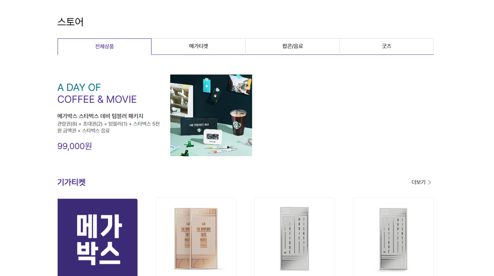
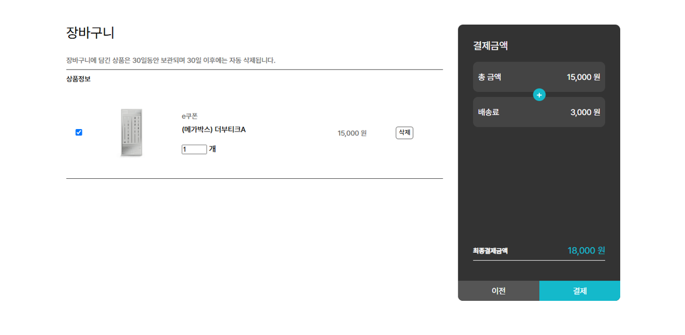

<h1>영화예매 및 영화 굿즈 판매 홈페이지, GIGABOX</h1>

제작기간 : 2024.11.25 ~ 2025.01.06

팀원 : 총 2명

 

<h3>프로젝트 담당기능(프론트엔드 & 백엔드)</h3>
<ul>
  <li>아이디, 비밀번호 찾기</li>
  <li>영화예매, 좌석예매</li>
  <li>극장 페이지</li>
  <li>스토어 (장바구니 담기)</li>
  <li>마이페이지</li>
</ul>
 

<h3>사용기술 & 라이브러리</h3>
<ul>
  <li>Spring boot3</li>
  <li>Java</li>
  <li>MySQL</li>
  <li>Thymeleaf</li>
  <li>JPA</li>
  <li>QueryDSL</li>
  <li></li>
</ul>
 

<h3>홈페이지 이미지</h3>
<h4>메인화면</h4>

 
<h4>영화 상세 페이지</h4>

 
<h4>영화 예매 페이지</h4>

 
<h4>좌석 예매 화면</h4>

 
<h4>스토어 페이지</h4>

 
<h4>스토어 상세 페이지</h4>

 
<h4>장바구니 페이지</h4>

